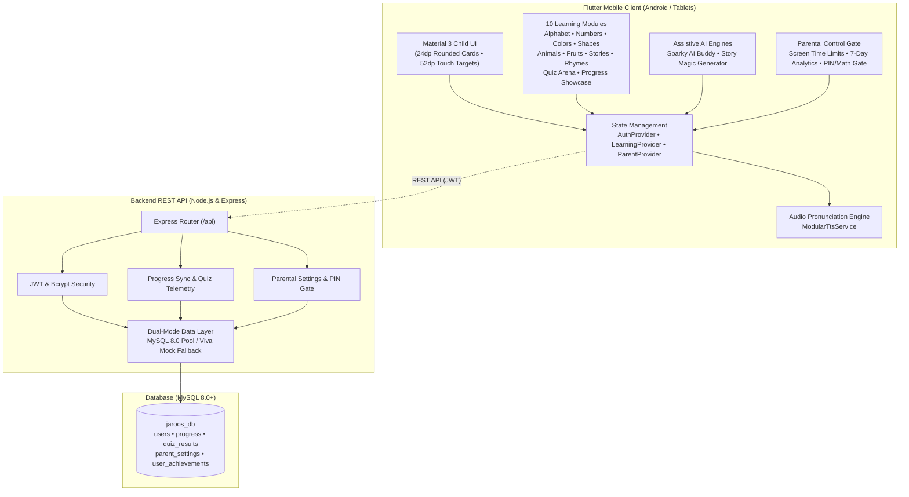

# JAROOS – An Interactive Educational App for Kids
> **Tagline**: *Learn • Play • Grow*  
> **Degree**: Master of Computer Applications (MCA) – Major Project  
> **Target Audience**: Early Learners (Ages 3–8) & Parents  

---

## 🌟 Executive Summary

**JAROOS** is an interactive, full-stack educational Android application and companion REST API engineered to make early childhood learning intuitive, playful, and safe. Built with **Flutter (Material 3)**, **Dart**, **Node.js**, **Express**, and **MySQL**, JAROOS bridges fundamental literacy, numeracy, and cognitive development with modern assistive AI companions, voice synthesis, digital wellness screen-time controls, and academic progress telemetry.

---

## 🏗️ System Architecture



---

## 🎯 10 Core Learning & System Modules

| # | Module | Description & Key Educational Highlights |
|---|---|---|
| **1** | **Alphabet Learning** | Letters A to Z with phonetic words, vivid emoji associations, vocal pronunciation, and letter card viewer. |
| **2** | **Numbers & Counting** | Numbers 1 to 20 with word spellings, visual counting items, and counting speech synthesis. |
| **3** | **Rainbow Colors** | 10 primary & secondary colors, real-world color associations, and interactive Magic Color Mixing tips. |
| **4** | **Geometric Shapes** | 8 basic shapes (Circle, Square, Triangle, Star, etc.) with sides/corners counters and daily life examples. |
| **5** | **Animals & Sounds** | 12 wild, farm, and ocean animals with interactive sound onomatopoeia (*"Roar!"*, *"Meow!"*, *"Moo!"*). |
| **6** | **Fruits & Vegetables** | 12 nutrient-rich foods with health superpower facts and audio pronunciation. |
| **7** | **Bedtime Moral Tales** | 6 illustrated classic stories (*Tortoise & Hare*, *Lion & Mouse*, etc.) with **"Read to Me"** narration and golden moral cards. |
| **8** | **Sing-Along Rhymes** | 8 classic nursery rhymes with lyrical stanzas and sing-along audio playback. |
| **9** | **Interactive Quiz Arena** | 4 quiz categories, immediate visual feedback, academic scoring formula $\text{score} = \left(\frac{\text{correct}}{\text{total}}\right) \times 100$, 1–3 star celebrations, and coin rewards. |
| **10** | **Progress & Badges** | Circular overall mastery gauge, 4-stat bar, 10 unlockable golden trophy badges, and 8-mascot avatar selector. |

---

## 🤖 AI Features & Child Safety Controls

### 1. Sparky AI Learning Buddy (`/ai-buddy`)
- Answers curious toddler STEM questions (*"Why is the sky blue?"*, *"How many legs does a spider have?"*, *"Why do birds sing?"*).
- Integrated **Child Safety Moderation Blocklist** intercepting unsafe vocabulary (`kill`, `gun`, `fight`, `scary`) with cheerful redirections.
- Automatic vocal TTS read-aloud for pre-literate children.

### 2. AI Bedtime Story Generator (`/ai-story-generator`)
- 3-step picker allowing the child or parent to select a **Hero** (e.g., Baby Dragon 🐉, Brave Bunny 🐰), a **Moral Theme** (e.g., Kindness 💖, Sharing 🧸), and a **Setting** (e.g., Enchanted Forest 🌲, Candy Kingdom 🍭).
- Dynamically creates personalized bedtime stories with moral takeaway cards and +10 coin reading rewards.

### 3. Parent Dashboard & Gate (`/parent-dashboard`)
- **Dual-Mode Security Gate**: Requires 4-digit PIN (`1234` default) or adult math challenge (`8 × 4 = ?`).
- **Digital Wellness**: Screen time limit chips (`15m`, `30m`, `45m`, `60m`, `Unlimited`).
- **7-Day Learning Activity**: Visual daily bar chart and subject mastery advice.
- **Curriculum Controls**: Individual toggle switches to enable/disable modules.
- **Viva Demo Mode**: 1-Tap "Demo Data 📊" loader instantly populates stats for academic inspection.

---

## 🗄️ Backend Architecture & Database Schema

The Node.js/Express backend provides a robust REST API located in [`backend/`](./backend/):
- **MySQL Relational Schema ([`schema.sql`](./backend/database/schema.sql))**:
  - `users`: ID (UUID), email, bcrypt password hash, child name, child age (2–12), avatar, favorite subject.
  - `progress`: User ID foreign key, streak days, total coins, overall percentage, module progress JSON.
  - `quiz_results`: Quiz category, score percentage, stars earned (0–3), coins earned, questions count.
  - `parent_settings`: PIN, daily time limits, math gate mode, allowed modules JSON, weekly activity JSON.
  - `user_achievements`: Badge ID, title, unlock status, coin rewards.
- **Zero-Setup Viva Mode**: Built-in in-memory fallback store (`USE_MOCK_DB=true`) so the server runs out-of-the-box without requiring a running MySQL server during project evaluations.
- **Automated Backend Suite**: 6 tests verifying health, JWT authentication, profile, progress, quiz telemetry, and PIN validation.

---

## 📂 Codebase Directory Structure

```
JAROOS/
├── android/                   # Native Android Gradle configuration
├── assets/                    # Image assets, animal emojis, icons, and audio
├── backend/                   # Node.js + Express + MySQL REST API
│   ├── database/
│   │   └── schema.sql         # 5-table relational schema & seed records
│   ├── src/
│   │   ├── config/db.js       # MySQL connection pool + Viva mock fallback
│   │   ├── controllers/       # Auth, Progress, and Parent controllers
│   │   ├── middleware/        # JWT Bearer token authentication
│   │   ├── routes/api.js      # REST API route declarations
│   │   └── server.js          # Express app entry point
│   ├── test/api.test.js       # Automated backend API test suite
│   └── package.json           # Node.js dependencies (express, mysql2, jwt, bcrypt)
├── lib/                       # Flutter Application Source
│   ├── core/
│   │   ├── constants/         # Module IDs, shared preferences keys
│   │   ├── routes/            # Central AppRoutes registry (19 routes)
│   │   ├── services/          # ModularTtsService audio engine
│   │   ├── theme/             # AppColors, AppTheme, AppTextStyles
│   │   └── utils/             # ResponsiveUtil (tablets vs phones)
│   ├── features/
│   │   ├── achievements/      # Trophy Room grid & badge modal
│   │   ├── ai_buddy/          # Sparky voice chat screen
│   │   ├── ai_stories/        # 3-step bedtime story generator
│   │   ├── alphabet/          # Phonics A to Z screen
│   │   ├── animals/           # Animal sounds & categories
│   │   ├── authentication/    # Login (1-Tap Demo) & Registration
│   │   ├── colors/            # Rainbow colors & mixing tips
│   │   ├── fruits/            # Healthy fruits & veggies
│   │   ├── home/              # Dashboard, header, streak banner, module cards
│   │   ├── numbers/           # 1 to 20 numbers & visual counting
│   │   ├── parent/            # Parent gate dialog & parent dashboard
│   │   ├── profile/           # Mascot avatar carousel & child details
│   │   ├── progress/          # Circular gauge & subject breakdown
│   │   ├── quiz/              # Quiz Arena with scoring formula
│   │   ├── rhymes/            # Sing-along nursery rhymes
│   │   ├── shapes/            # Geometric shapes screen
│   │   ├── splash/            # Animated star mascot splash screen
│   │   └── stories/           # Bedtime stories with Read to Me player
│   ├── models/                # Strongly typed domain entities
│   ├── providers/             # AuthProvider, LearningProvider, ParentProvider
│   ├── services/              # AiService, StorageService, ApiService
│   └── main.dart              # MultiProvider tree & application entry point
├── test/                      # 9 Comprehensive Flutter Automated Test Suites
│   ├── ai_features_test.dart
│   ├── auth_test.dart
│   ├── early_learning_modules_test.dart
│   ├── media_learning_modules_test.dart
│   ├── parent_dashboard_test.dart
│   ├── progress_achievements_profile_test.dart
│   ├── quiz_test.dart
│   └── widget_test.dart
└── pubspec.yaml               # Flutter package configuration
```

---

## 🚀 Execution & Setup Guide

### 1. Prerequisites
- **Flutter SDK**: v3.47+ / Dart v3.13+
- **Android SDK**: API Level 34+
- **Node.js**: v18+ (tested on Node v24)
- **Java JDK**: JDK 17 or JDK 21

### 2. Running the Node.js REST API
```bash
cd backend
npm.cmd install
npm.cmd start
```
*API server will listen on `http://localhost:5000` with health check at `http://localhost:5000/api/health`.*

### 3. Running Backend Automated Tests
```bash
cd backend
node test/api.test.js
```
*Executes 6 integration tests verifying health, auth, progress sync, and PIN security.*

### 4. Running the Flutter Test Suite
```bash
flutter test
```
*Executes all 52 unit and widget tests across the 9 test suites (100% green).*

### 5. Running the Flutter Application
```bash
flutter run
```

### 6. Precompiled APK Location
The compiled Android debug APK is ready for installation on any physical device or emulator:
- **Path**: `build\app\outputs\flutter-apk\app-debug.apk`
- **Size**: ~178 MB (includes full offline assets, fonts, sounds, and Flutter engine).

---

## 🎓 Viva Voce Defense Quick Reference

1. **Why Flutter instead of native Android?**  
   Flutter provides single-codebase rendering via Skia/Impeller, enabling 60/120 FPS high-frame-rate tactile animations, consistent tablet-to-phone responsive layouts, and child touch targets without native bridge overhead.

2. **Why Provider for State Management?**  
   `ChangeNotifierProvider` cleanly decouples presentation from domain logic, avoids the verbose boilerplate of Bloc, and facilitates dependency injection for offline mock services (`ModularTtsService`, `ModularAiService`).

3. **How is child safety ensured?**  
   Child safety is enforced via a dual-mode Parent Gate (PIN/Math challenge), strict AI moderation keyword blocklists, digital wellness daily screen-time limits, and an ad-free, walled-garden content architecture.

4. **How does the app work offline?**  
   All 10 modules, audio soundboards, and the curiosity knowledge base operate 100% offline. Progress is synced via REST API with JWT authorization whenever an internet connection is available.

---

## 📜 Academic Declaration
This project is submitted in partial fulfillment of the requirements for the degree of **Master of Computer Applications (MCA)**. All software architectures, code modules, database designs, and verification tests were designed and implemented for high academic and industry standards.
